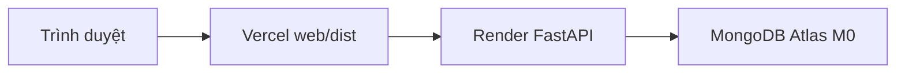

# Hướng dẫn Web App quản trị (Vite)

Web app riêng cho **cán bộ quản lý**: bản đồ quy hoạch, nghi vấn vi phạm, duyệt báo cáo. Dùng chung API FastAPI và MongoDB với app mobile Expo.

---

## Cấu trúc

```
web/                 # Vite + React + MapLibre
backend/             # FastAPI (port 8000)
frontend/            # Expo mobile (không liên quan khi chỉ chạy web)
```

---

## Chạy local (dev)

**Terminal 1 — MongoDB** (nếu chưa chạy service):

```powershell
cd D:\mongodb-win32-x86_64-windows-8.3.2\bin
.\mongod.exe --dbpath D:\mongodb-win32-x86_64-windows-8.3.2\bin\DB
```

**Terminal 2 — Backend API:**

```powershell
cd c:\Users\kimli\Downloads\Mobile_app_for_planning-main\backend
.\venv\Scripts\Activate.ps1
uvicorn server:app --host 0.0.0.0 --port 8000 --reload
```

**Terminal 3 — Web:**

```powershell
cd c:\Users\kimli\Downloads\Mobile_app_for_planning-main\web
copy .env.example .env
npm install
npm run dev
```

Mở trình duyệt: http://localhost:5173

### Đăng nhập admin

| Email | Mật khẩu |
|-------|----------|
| `admin@quyhoach.vn` | `Admin@123` |

---

## Biến môi trường

| File | Biến | Mô tả |
|------|------|--------|
| `web/.env` | `VITE_API_URL` | URL backend, ví dụ `http://localhost:8000` |
| `web/.env` | `VITE_GIS_ZONES_URL` | (Tùy chọn) URL GeoJSON; mặc định `/data/planning_zones_demo.geojson` |
| `backend/.env` | `MONGO_URL`, `DB_NAME`, `JWT_SECRET` | Database và JWT |
| `backend/.env` | `CORS_ORIGINS` | `http://localhost:5173` hoặc `*` khi dev |

---

## API web sử dụng

- `POST /api/auth/login`, `GET /api/auth/me`
- `GET /api/admin/stats`
- `GET /api/reports`, `PUT /api/reports/{id}`
- `GET /api/planning/zones`, `GET /api/planning/buildings`
- `GET /api/violations`, `PATCH /api/violations/{id}/review`

---

## Production — Atlas + Render + Vercel (miễn phí, truy cập từ xa)

Khách/cán bộ truy cập web qua internet, **không cần cùng WiFi** với máy dev.



| Thành phần | Host | URL ví dụ |
|------------|------|-----------|
| MongoDB | [MongoDB Atlas M0](https://www.mongodb.com/cloud/atlas/register) | (connection string nội bộ) |
| API | [Render](https://render.com) — thư mục `backend/` | `https://quyhoach-api.onrender.com` |
| Web | [Vercel](https://vercel.com) — thư mục `web/` | `https://quyhoach-web.vercel.app` |

**Lưu ý:** Render free tier **ngủ sau ~15 phút** không có request; lần mở đầu có thể chậm 30–60 giây.

Repo có sẵn [`render.yaml`](render.yaml) để deploy backend lặp lại dễ hơn.

---

### Bước 0 — Đẩy code lên GitHub

Repo đã có git local. Tạo repo mới trên https://github.com/new rồi chạy:

```powershell
cd c:\Users\kimli\Downloads\Mobile_app_for_planning-main
.\scripts\push-github.ps1 -GitHubUser "<user>" -RepoName "Mobile_app_for_planning"
```

Hoặc thủ công:

```powershell
git remote add origin https://github.com/<user>/<repo>.git
git branch -M main
git push -u origin main
```

**Không** commit file `.env` — đã có trong `.gitignore`. Chỉ dùng `.env.example` làm mẫu.

**Lưu ý Render:** `backend/requirements.txt` đã bỏ `emergentintegrations` (không có trên PyPI) — web admin deploy bình thường; tính năng AI compare trên mobile cần cài package riêng khi dev local.

---

### Bước 1 — MongoDB Atlas

1. Đăng ký [MongoDB Atlas](https://www.mongodb.com/cloud/atlas/register).
2. **Create deployment** → chọn **M0 FREE**, region **Singapore (`ap-southeast-1`)**.
3. **Database Access** → Add user (username + password mạnh) → lưu lại.
4. **Network Access** → **Add IP Address** → **Allow Access from Anywhere** (`0.0.0.0/0`).
5. **Database** → **Connect** → **Drivers** → copy connection string:
   ```
   mongodb+srv://<user>:<password>@cluster0.xxxxx.mongodb.net/?retryWrites=true&w=majority
   ```
6. Thay `<password>` bằng mật khẩu thật (URL-encode ký tự đặc biệt nếu có).
7. Tên database: **`quyhoach`** (khớp `DB_NAME`).

Backend tự **seed** user admin và dữ liệu demo khi DB trống. Đăng nhập: `admin@quyhoach.vn` / `Admin@123`.

---

### Bước 2 — Deploy Backend (Render)

**Cách A — Blueprint (khuyến nghị):** Render Dashboard → **New** → **Blueprint** → connect repo → chọn `render.yaml` → nhập secrets `MONGO_URL`, `CORS_ORIGINS`.

**Cách B — Web Service thủ công:**

1. [render.com](https://render.com) → **New +** → **Web Service** → Connect GitHub repo.
2. Cấu hình:

| Mục | Giá trị |
|-----|---------|
| Root Directory | `backend` |
| Runtime | Python 3 |
| Build Command | `pip install -r requirements.txt` |
| Start Command | `uvicorn server:app --host 0.0.0.0 --port $PORT` |

3. **Environment Variables:**

| Biến | Giá trị |
|------|---------|
| `MONGO_URL` | Connection string Atlas (bước 1) |
| `DB_NAME` | `quyhoach` |
| `JWT_SECRET` | Chuỗi ngẫu nhiên 32+ ký tự (khác `dev-secret-change-me`) |
| `CORS_ORIGINS` | Tạm `*` khi test; sau có URL Vercel → `https://ten-app.vercel.app` |

4. Deploy → lấy URL, ví dụ `https://quyhoach-api.onrender.com`.
5. Kiểm tra: mở `https://<url>/api/` → `{"app":"QuyHoạch AI","ok":true}`.

---

### Bước 3 — Deploy Web (Vercel)

1. [vercel.com](https://vercel.com) → **Add New Project** → import cùng GitHub repo.
2. Cấu hình:

| Mục | Giá trị |
|-----|---------|
| Root Directory | `web` |
| Framework | Vite |
| Build Command | `npm run build` |
| Output Directory | `dist` |

3. **Environment Variable:**

| Biến | Giá trị |
|------|---------|
| `VITE_API_URL` | `https://quyhoach-api.onrender.com` (URL Render, **không** có `/api`) |

4. Deploy → URL ví dụ `https://quyhoach-web.vercel.app`.
5. Quay lại Render → cập nhật `CORS_ORIGINS` = URL Vercel chính xác → **Manual Deploy** lại API.

---

### Bước 4 — Kiểm tra truy cập từ xa

1. Mở URL Vercel trên điện thoại **4G/5G** (tắt WiFi).
2. Hoặc nhờ người khác (mạng khác) mở cùng URL.
3. Đăng nhập `admin@quyhoach.vn` / `Admin@123`.
4. Nếu trang trắng/lỗi API lần đầu → đợi Render wake up (~1 phút), refresh.

---

### Biến môi trường production (tóm tắt)

```
MongoDB Atlas     → MONGO_URL, DB_NAME=quyhoach
Render (backend) → MONGO_URL, DB_NAME, JWT_SECRET, CORS_ORIGINS
Vercel (web)     → VITE_API_URL=https://xxx.onrender.com
```

---

### Nâng cấp — Fly.io (API luôn online)

Nếu có thẻ tín dụng và cần API không sleep:

| Thành phần | Host |
|------------|------|
| MongoDB | MongoDB Atlas |
| API | Fly.io — deploy `backend/` (cần `Dockerfile`) |
| Web | Vercel/Netlify |

Set secrets Fly: `MONGO_URL`, `DB_NAME`, `JWT_SECRET`, `CORS_ORIGINS=https://<web-domain>.vercel.app`

Web Vercel: `VITE_API_URL=https://<ten-app>.fly.dev`

**Mobile** (nếu dùng song song): `EXPO_PUBLIC_BACKEND_URL` cùng URL API production.

---

## Dữ liệu demo GIS

- File tĩnh: `web/public/data/planning_zones_demo.geojson`
- Mongo (sau seed): collections `planning_zones`, `observed_buildings`, `violations`

Restart backend một lần để `seed_planning_data()` chạy khi DB trống.
